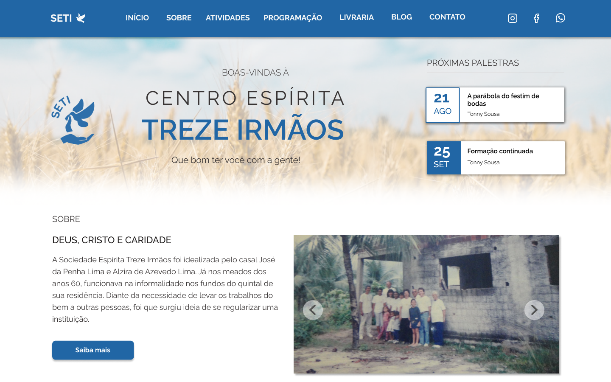

<h1 align="center">
  Centro Espírita Treze Irmãos ✨
</h1>

  
  
  
  

 

  

## 💻 Projeto

O projeto "Centro Espírita Treze Irmãos" é a landing page de uma casa espírita localizada em João Pessoa/PB. Ele foi desenvolvido com React, Next.js e TypeScript. Nele, é possível conhecer um pouco mais sobre o centro, suas atividades e informações para contato. Além disso, a sessão do blog contém postagens relacionadas à Doutrina Espírita.

## ✨ Tecnologias

Esse projeto foi desenvolvido com as seguintes tecnologias:

- [React](https://reactjs.org)
- [TypeScript](https://www.typescriptlang.org/)
- [Next.js](https://nextjs.org/)
- [Styled Components](https://styled-components.com/)
- [React Icons](https://react-icons.github.io/react-icons/)

## 📖 Conhecimento
No projeto, utilizei: 
* `Typescript` para adicionar tipagem estática ao JavaScript;
* `styled-components` para estilização;
